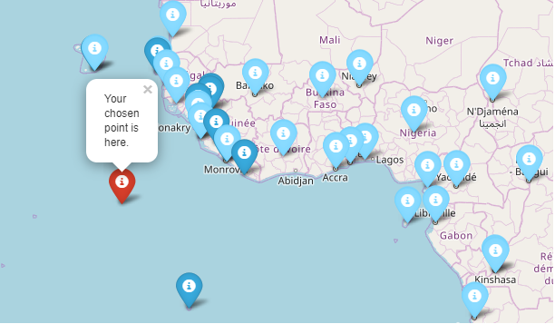
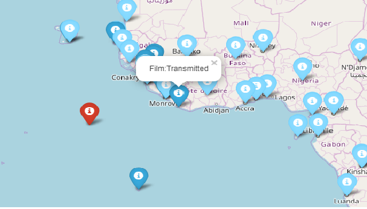

# Butynets' HTML Film and Capitals Map
1. This module is supposed to generate html map with markers around desired point containing an information about the 
movies(in amount from 1 to 10) which were filmed in the mentioned year. In addition, it shows the location and name of 
all the capitals around the world, along with the country's name.
  
2. The map is a default geographical map and the markers are divided into three categories: targeted location, 1 to 10 
marker pointing to the location of movie filming and about 250 marker for the capitals.

3. The map allows us to analise film-making in a certain area in a specific year, as well as study the location of each 
country's capital.

4.  Example:

python main.py

Please, enter a year you would like to have a map for: 2008

Enter your latitude: 2.178

Enter your longitude: -20.9

Enter the number of closest film locations(max 10): 10

Map is generating...

Please wait...

Finished. Please have look at the: map.html

Screenshots:

Installation:

git clone https://github.com/Dranixia/task2.git

cd task2

pip install -r requirements.txt

python main.py